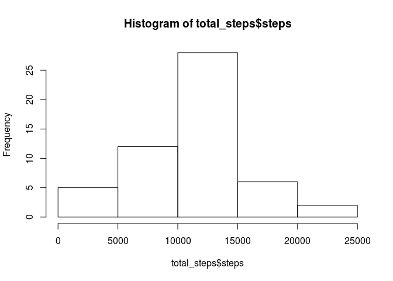
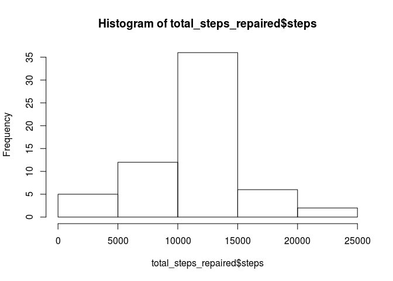

# Reproducible Research: Peer Assessment 1


## Loading and preprocessing the data

```r
activity<-read.csv("./activity.csv")
```
## What is mean total number of steps taken per day?

```r
total_steps<-aggregate(steps ~ date, data = activity, sum, na.rm=TRUE)
hist(total_steps$steps)
```

 

```r
#barplot(total_steps$steps)

steps_mean <- mean(total_steps$steps)
steps_median <- median(total_steps$steps)
```

The mean of steps is:

```
## [1] 10766.19
```

The median of steps is:

```
## [1] 10765
```

## What is the average daily activity pattern?

```r
mean_steps_interval <-aggregate(steps ~ interval, data = activity, mean, na.rm=TRUE)
plot(steps ~ interval, data = mean_steps_interval, type="l")
```

 

```r
max_steps_interval <- mean_steps_interval[which.max(mean_steps_interval$steps),]$interval
```

The

```
## [1] 835
```
interval contains the maximum number of steps.

## Imputing missing values

```r
missing_count <- sum(is.na(activity$steps))
```

We have

```
## [1] 2304
```
of missing values.


```r
replace_na_with_mean <- function(x){ 
    m <- as.integer(mean(x, na.rm = TRUE))
    x[is.na(x)] <- m 
    x 
}

activity_repaired <- activity

#replace na with the mean value
activity_repaired$steps <- ave(activity$steps, activity$interval, FUN = replace_na_with_mean)

#activity_repaired

total_steps_repaired <-aggregate(steps ~ date, data = activity_repaired, sum, na.rm=TRUE)
hist(total_steps_repaired$steps)
```

 

```r
steps_mean_repaired <- mean(total_steps_repaired$steps)
steps_median_repaired <- median(total_steps_repaired$steps)
```

The repaired mean of steps is:

```
## [1] 10749.77
```

The repaired median of steps is:

```
## [1] 10641
```

## Are there differences in activity patterns between weekdays and weekends?
sorry!
